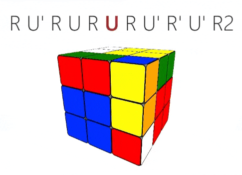

<div align="center">

# 3D Animated Rubik's Cube Solving Guide




[Live Demo](https://ikwbb.github.io/rubik-guide/index.html)

</div>
<br>

This project is an interactive web-based guide designed to teach beginners how to solve a Rubik's Cube using the layer-by-layer method. It features 3D animations to visually demonstrate each step and algorithm, making the learning process engaging and easier to follow. The guide breaks down the solving process into manageable sections, each focusing on a specific layer of the cube.

## How to Use

1. **Local Use**: 
   - Clone this repository to your local machine using:
     ```bash
     git clone https://github.com/your-username/3d-animated-rubiks-cube.git
     ```
   - Open the `index.html` file in a modern web browser (e.g., Chrome, Firefox, Safari).
2. **Online Access**: 
   - Visit [link to hosted version](https://ikwbb.github.io/rubik-guide/index.html) to use the guide directly online (replace with the actual URL if hosted, e.g., on GitHub Pages).

The guide is organized into the following sections, accessible via the navigation bar:

- **Introduction**: Covers basic knowledge about the Rubik's Cube, including notation (e.g., R, U, F) and the cube's structure (center, edge, and corner pieces).
- **First Layer**: Step-by-step instructions to solve the first layer.
- **Second Layer**: Techniques to complete the second layer.
- **Third Layer (Top)**: Methods to form a cross and solve the top face of the third layer.
- **Third Layer (Side)**: Final steps to position the side pieces and complete the cube.

Each section includes interactive 3D animations to demonstrate the algorithms required to achieve the sub-goals.

### Interactive Features

- **Algorithm Demonstrations**: Click on the cards within each section to launch a modal displaying a 3D animation of the Rubik's Cube performing the specified algorithm. The algorithm is shown in text form with the current move highlighted.
- **Speed Control**: Adjust the animation speed using the "Slower" and "Faster" buttons in the modal.
- **Replay**: Use the "Replay" button to re-watch the animation as needed.

## Requirements

- A modern web browser (e.g., Chrome, Firefox, Safari).
- JavaScript must be enabled in the browser to support the interactive features.
- No additional software or libraries are required, as all dependencies (e.g., Bootstrap, custom scripts) are included in the project.

## Technologies Used

- **HTML5**: Structures the content of the guide.
- **CSS3**: Provides styling, enhanced with Bootstrap for a responsive design.
- **JavaScript**: Powers the interactive features, including custom scripts for 3D cube rendering and animations.

The 3D animations are driven by custom JavaScript code leveraging CSS3 transformations and quaternion mathematics for smooth and accurate cube rotations, which is originally implemented by [Google](https://github.com/googlearchive/realtime-cube).
